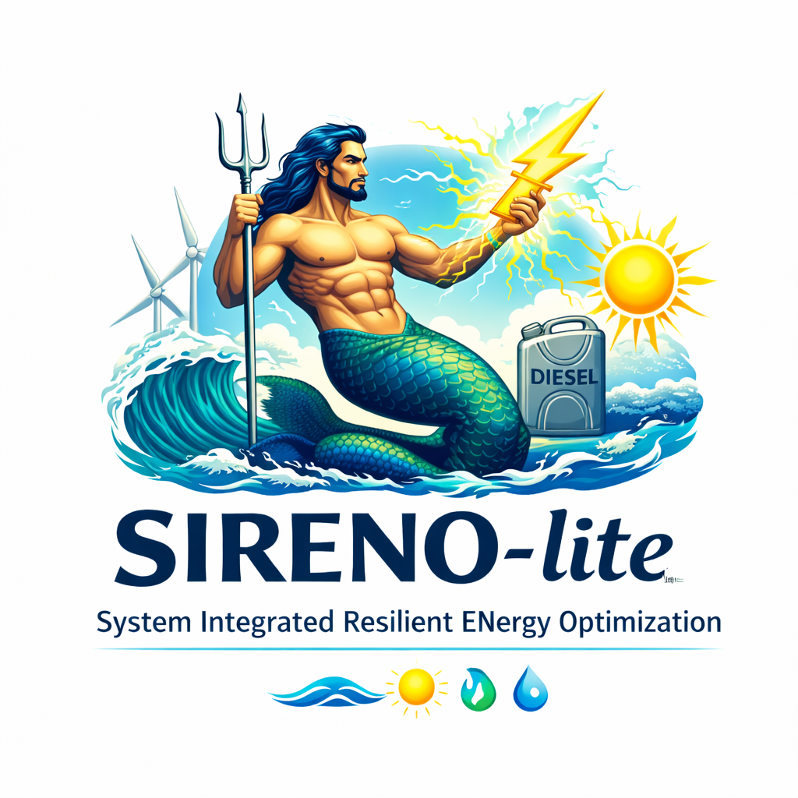

# SIRENO-lite (System-Integrated Resilient ENergy Optimizer)

[](https://github.com/JuliaOceanWaves/SIRENO-Lite/actions/workflows/tests.yml)
[](https://github.com/JuliaOceanWaves/SIRENO-Lite/actions/workflows/tests.yml)
[](https://github.com/JuliaOceanWaves/SIRENO-Lite/actions/workflows/docs.yml)
[](https://github.com/JuliaOceanWaves/SIRENO-Lite/actions/workflows/build_gui.yml)
[](https://github.com/JuliaOceanWaves/SIRENO-Lite/releases/latest)



SIRENO-lite is a GEKKO-based dynamic optimization model for sizing and dispatching a hybrid system with wind, solar, wave, generator, battery, hydrogen production/storage, and potable water production/storage.

NOTE: Heavy AI assistance was used for developing the GUI, the docs, tests, reorganization, logo, and some additions to the base hybrid system optimization script.  Please use with caution and note the NOTICE and LICENSE file limitations on guarantees etc.

Docs: https://juliaoceanwaves.github.io/SIRENO-lite/

Version: 1.0.0

Install
```bash
python3 -m pip install .
```

Editable install (development)
```bash
python3 -m pip install -e .
```

Run the GUI
```bash
sirenolite-gui
```

Generate a JSON config template
```bash
sirenolite --dump-config config.json
```

Run with a JSON config file
```bash
sirenolite --config config.json
```

Downloads
- Prebuilt binaries: https://github.com/JuliaOceanWaves/SIRENO-Lite/releases/latest

Tests
```bash
python3 -m pip install -r requirements-dev.txt
pytest
```
